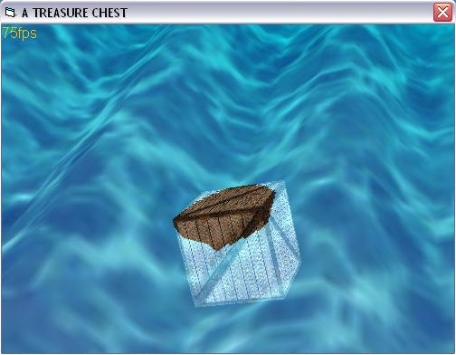



## Treasure Chest \(DirectX\)

### Description

Remember the old days when the Black Avenger of the Spanish Main (alias Tom Sawyer) roamed the Carribean Seas and spread terror among his foes? Well, this is what went overboard one day and you are the lucky one to find it.
 
### More Info
 

             |
---                |---
**Submitted On**   |2003-06-07 13:23:42
**By**             |[ULLI](https://github.com/Planet-Source-Code/PSCIndex/blob/master/ByAuthor/ulli.md)
**Level**          |Advanced
**User Rating**    |4.7 (33 globes from 7 users)
**Compatibility**  |VB 6\.0
**Category**       |[DirectX](https://github.com/Planet-Source-Code/PSCIndex/blob/master/ByCategory/directx__1-44.md)
**World**          |[Visual Basic](https://github.com/Planet-Source-Code/PSCIndex/blob/master/ByWorld/visual-basic.md)
**Archive File**   |[Treasure\_C18069410172004\.zip](https://github.com/Planet-Source-Code/ulli-treasure-chest-directx__1-56794/archive/master.zip)

